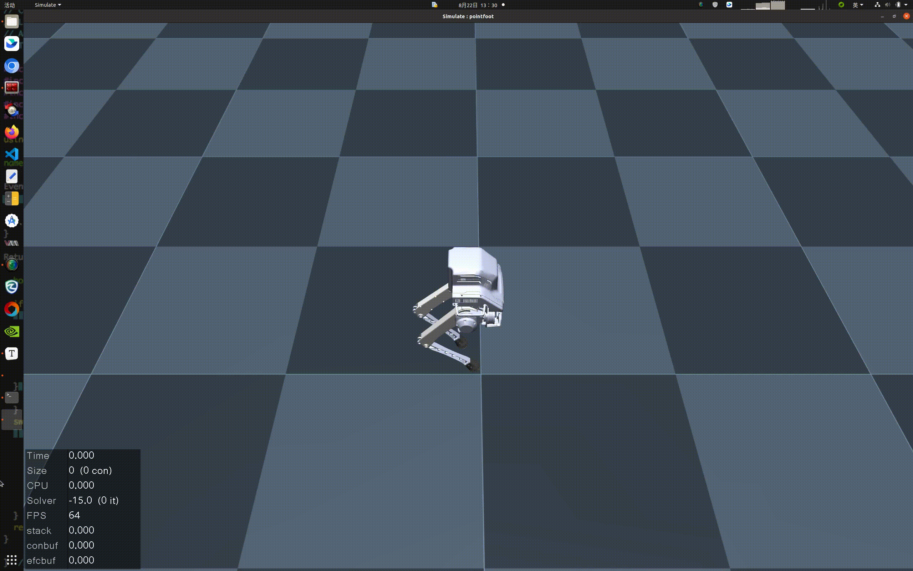

# pointfoot-mujoco-sim


## 1. 搭建开发环境

我们建议在 Ubuntu 20.04 及以上版本上搭建基于 MuJoCo 的算法仿真开发环境。请在 Bash 终端中运行以下命令，以安装所需的依赖库：

```
sudo apt update
sudo apt install -y libglfw3 libglfw3-dev cmake build-essential
```


## 2. 编译运行仿真

- 打开一个 Bash 终端。

- 下载 MuJoCo 仿真器代码：

  ```
  git clone https://github.com/limxdynamics/pointfoot-mujoco-sim.git
  ```

- 编译 MuJoCo 仿真器：

  ```
  cd pointfoot-mujoco-sim
  mkdir -p build
  cd build
  cmake ..
  make
  ```

- 运行 MuJoCo 仿真器：

  ```
  cd build
  ./pointfoot_mujoco_sim
  ```

  

## 3. 编译运行控制

- 打开一个 Bash 终端。

- 下载控制器SDK示例代码：

  ```
  git clone https://github.com/limxdynamics/pointfoot-sdk-lowlevel.git
  ```

- 编译控制器SDK示例：

  ```
  cd pointfoot-sdk-lowlevel
  mkdir -p build
  cd build
  cmake ..
  make
  ```

- 运行控制器SDK示例：

  ```
  cd build
  ./examples/pf_groupJoints_move
  ```


## 4. 运行可视化工具

- 打开一个 Bash 终端。

- 运行可视化工具

  ```
  cd pointfoot-mujoco-sim/build
  ./pointfoot_mujoco_vis 127.0.0.1  # 机器人实际的IP地址
  ```


## 5. 仿真展示


## 6. 可视化展示

